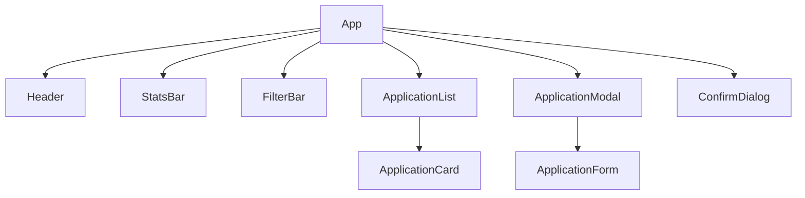

# 📋 Applications Tracker — Product Requirements Document (PRD)

> **Author:** Razi  
> **Date:** August 5, 2026  
> **Duration:** 1-week side project  
> **Audience:** Junior developer (learning project)  
> **Repository:** You will create your own on GitHub (see Step 0)

---

---

## 0. Step Zero — GitHub Repo & PR Workflow

Before writing any code, set up the project repository on GitHub and establish a Pull Request (PR) workflow. 

### 0.1 GitHub Repository Setup
Create a new public repository on GitHub named `applications-tracker`. Clone the repository locally to begin development.

### 0.2 PR-Based Workflow
All development must follow a branch-and-merge strategy. Direct commits to the `main` branch are prohibited.
- For each day's task, create a dedicated feature branch using the naming convention below.
- Commit code with descriptive messages.
- Push the branch to GitHub and open a Pull Request (PR).
- Merge the PR to `main` once the daily feature is fully verified.

### 0.3 Branch Naming Convention

Use this format: `day-N/short-description`

| Day | Branch Name | PR Title |
|-----|------------|----------|
| Day 1 | `day-1/project-setup` | Day 1: Project Setup |
| Day 2 | `day-2/types-and-layout` | Day 2: Types & Layout Components |
| Day 3 | `day-3/storage-and-data` | Day 3: Storage & Data Layer |
| Day 4 | `day-4/form-and-modal` | Day 4: Form & Modal |
| Day 5 | `day-5/edit-delete-status` | Day 5: Edit, Delete & Status |
| Day 6 | `day-6/search-filter-polish` | Day 6: Search, Filter & Polish |
| Day 7 | `day-7/deploy-and-readme` | Day 7: Deploy & README |

### 0.4 Commit Message Format

Use prefixes so your git history is readable:

| Prefix | When to use | Example |
|--------|------------|----------|
| `feat:` | New feature | `feat: add delete confirmation dialog` |
| `fix:` | Bug fix | `fix: form not clearing after submit` |
| `style:` | CSS/styling only | `style: improve card hover effect` |
| `refactor:` | Code restructure (no behavior change) | `refactor: extract StatusBadge component` |
| `docs:` | Documentation | `docs: update README with screenshots` |
| `chore:` | Config/setup | `chore: configure Tailwind CSS` |

---

## 1. Product Overview

### What is it?
A **single-page web application** that helps job seekers track their job applications in one place — replacing messy spreadsheets with a clean, modern UI.

### Why build it?
- People use Excel/Google Sheets to track applications — it works but it's ugly and hard to filter
- A dedicated UI makes it faster to add, update, and visualize application status
- It's a great learning project that covers **React, TypeScript, Tailwind CSS, and modern tooling**

### Who is it for?
Anyone actively applying for jobs who wants a simple, free, private tracker that runs in their browser.

---

## 2. Tech Stack

| Layer | Technology | Why |
|-------|-----------|-----|
| **Framework** | [React 18+](https://react.dev/) | Component-based UI, industry standard |
| **Build Tool** | [Vite](https://vite.dev/) | Lightning-fast dev server & builds |
| **Language** | [TypeScript](https://www.typescriptlang.org/) | Type safety, better DX, industry standard |
| **Styling** | [Tailwind CSS v4](https://tailwindcss.com/) | Utility-first CSS, fast prototyping |
| **Storage** | `localStorage` | Free, no backend needed, data stays in the browser |
| **Hosting** | GitHub Pages | Free static hosting, deploys from the repo |
| **Version Control** | Git + GitHub | Track progress, learn git workflow |

### Prerequisites (Install Before Starting)
- **Node.js** (v18 or later) → [nodejs.org](https://nodejs.org/)
- **npm** (comes with Node.js)
- **Git** → [git-scm.com](https://git-scm.com/)
- **VS Code** (recommended) → [code.visualstudio.com](https://code.visualstudio.com/)

### Recommended VS Code Extensions
- `ES7+ React/Redux/React-Native snippets` — shortcut snippets for React
- `Tailwind CSS IntelliSense` — autocomplete for Tailwind classes
- `TypeScript Importer` — auto-import suggestions
- `Prettier` — code formatting

---

## 3. Project Setup (Day 1)

### 3.1 Initialize the Project
Initialize a new React project using Vite with TypeScript. Set up the development server and verify it runs successfully.

Install and configure Tailwind CSS (v4) for styling.

### 3.2 Configure Project Settings
- Configure the Vite build system to include the Tailwind CSS plugin.
- Ensure the build base path matches the repository name (e.g., `/applications-tracker/`) to support GitHub Pages.
- Import Tailwind's stylesheet directives into the application's global CSS file.

### 3.3 Configure GitHub Pages Deployment
- Configure the build and deploy settings in the project configuration.
- Integrate a tool/script configuration in `package.json` that automates building the project (`npm run build`) and deploying the output folder (typically `dist`) to the `gh-pages` branch on GitHub.
- After deployment, the project should be live at: `https://YOUR-USERNAME.github.io/applications-tracker/`

---

## 4. Features

### 4.1 Core Features (Must Have)

| # | Feature | Description |
|---|---------|-------------|
| F1 | **Add Application** | A modal form to add a new job application with all fields |
| F2 | **View Applications** | A card list or table showing all tracked applications |
| F3 | **Edit Application** | Click on an application to update its details |
| F4 | **Delete Application** | Remove an application with a confirmation prompt |
| F5 | **Status Tracking** | Update application status through predefined stages |
| F6 | **Persistent Storage** | Data saved in `localStorage` — survives page refresh |
| F7 | **Search & Filter** | Filter by status, search by company name or position |

### 4.2 Nice-to-Have Features (If Time Permits)

| # | Feature | Description |
|---|---------|-------------|
| N1 | **Dashboard Stats** | Summary cards: total apps, interviews, offers, rejections |
| N2 | **Sort by Date** | Sort applications by date applied (newest/oldest first) |
| N3 | **Export to CSV** | Download all data as a `.csv` file |
| N4 | **Import from CSV** | Upload a `.csv` to bulk-add applications |
| N5 | **Dark Mode Toggle** | Switch between light and dark themes |
| N6 | **Color-coded Status** | Each status gets a distinct color badge |

---

## 5. Data Model (TypeScript)

### 5.1 Types — create `src/types/index.ts`

```typescript
// All possible application statuses
export enum ApplicationStatus {
  Saved = "saved",
  Applied = "applied",
  InReview = "in_review",
  PhoneScreen = "phone_screen",
  Interview = "interview",
  Technical = "technical",
  FinalRound = "final_round",
  Offer = "offer",
  Accepted = "accepted",
  Rejected = "rejected",
  Withdrawn = "withdrawn",
}

// The main data shape for a job application
export interface Application {
  id: string;                    // Unique ID (use crypto.randomUUID())
  companyName: string;           // Required — Company name
  position: string;              // Required — Job title / role
  applicationUrl: string;        // Optional — Link to the job posting
  country: string;               // Optional — Country of the job
  location: string;              // Optional — City or "Remote"
  status: ApplicationStatus;     // Required — Current status
  dateApplied: string;           // Required — When applied (YYYY-MM-DD)
  dateUpdated: string;           // Auto-set — Last modification date
  salary: string;                // Optional — Salary range
  contactPerson: string;         // Optional — Recruiter / contact name
  notes: string;                 // Optional — Free-text notes
}
```

### 5.2 Status Display Config — create `src/config/statuses.ts`

```typescript
import { ApplicationStatus } from "../types";

export interface StatusConfig {
  label: string;
  emoji: string;
  color: string;       // Tailwind text color class
  bgColor: string;     // Tailwind background color class
}

export const STATUS_CONFIG: Record<ApplicationStatus, StatusConfig> = {
  [ApplicationStatus.Saved]:       { label: "Saved",       emoji: "📌", color: "text-gray-400",   bgColor: "bg-gray-400/10" },
  [ApplicationStatus.Applied]:     { label: "Applied",     emoji: "📤", color: "text-blue-400",   bgColor: "bg-blue-400/10" },
  [ApplicationStatus.InReview]:    { label: "In Review",   emoji: "👀", color: "text-yellow-400", bgColor: "bg-yellow-400/10" },
  [ApplicationStatus.PhoneScreen]: { label: "Phone Screen",emoji: "📞", color: "text-cyan-400",   bgColor: "bg-cyan-400/10" },
  [ApplicationStatus.Interview]:   { label: "Interview",   emoji: "🎤", color: "text-purple-400", bgColor: "bg-purple-400/10" },
  [ApplicationStatus.Technical]:   { label: "Technical",   emoji: "💻", color: "text-indigo-400", bgColor: "bg-indigo-400/10" },
  [ApplicationStatus.FinalRound]:  { label: "Final Round", emoji: "🏁", color: "text-orange-400", bgColor: "bg-orange-400/10" },
  [ApplicationStatus.Offer]:       { label: "Offer",       emoji: "🎉", color: "text-green-400",  bgColor: "bg-green-400/10" },
  [ApplicationStatus.Accepted]:    { label: "Accepted",    emoji: "✅", color: "text-emerald-400",bgColor: "bg-emerald-400/10" },
  [ApplicationStatus.Rejected]:    { label: "Rejected",    emoji: "❌", color: "text-red-400",    bgColor: "bg-red-400/10" },
  [ApplicationStatus.Withdrawn]:   { label: "Withdrawn",   emoji: "🚫", color: "text-slate-400",  bgColor: "bg-slate-400/10" },
};
```

---

## 6. Component Architecture

### 6.1 Component Tree



### 6.2 Components Breakdown

| Component | Responsibility |
|-----------|----------------|
| **App** | Root component. Holds state, renders layout. |
| **Header** | App title + "Add New" button |
| **StatsBar** | Summary cards (total, interviews, offers, etc.) |
| **FilterBar** | Search input + status dropdown + sort selector |
| **ApplicationList** | Maps over filtered apps, renders cards. Shows empty state. |
| **ApplicationCard** | Single application card with status badge, edit/delete buttons |
| **ApplicationModal** | Modal wrapper using `<dialog>`. Contains the form. |
| **ApplicationForm** | The actual form with inputs, validation, submit handler |
| **ConfirmDialog** | "Are you sure?" confirmation for deletes |
| **StatusBadge** | Reusable colored badge showing status emoji + label |

### 6.3 State Management

Use **React `useState`** — no Redux or external state library needed for this project.

State lives in `App.tsx`:
```typescript
const [applications, setApplications] = useState<Application[]>([]);
const [searchQuery, setSearchQuery] = useState("");
const [statusFilter, setStatusFilter] = useState<ApplicationStatus | "all">("all");
const [sortOrder, setSortOrder] = useState<"newest" | "oldest">("newest");
const [isModalOpen, setIsModalOpen] = useState(false);
const [editingApp, setEditingApp] = useState<Application | null>(null);
```

> [!TIP]
> **Custom Hook:** Extract localStorage logic into a `useLocalStorage` hook in `src/hooks/useLocalStorage.ts`. This makes it reusable and keeps `App.tsx` clean.

---

## 7. UI / UX Specifications

### 7.1 Design Guidelines

| Aspect | Guideline |
|--------|-----------|
| **Theme** | Dark mode default — `bg-gray-950` body, `bg-gray-900` cards |
| **Font** | Use [Inter](https://fonts.google.com/specimen/Inter) via Google Fonts |
| **Accent Color** | Blue-violet gradient (`from-blue-500 to-violet-500`) |
| **Status Badges** | Colored pill badges using the `StatusConfig` mapping |
| **Responsiveness** | Mobile-first — cards stack vertically on small screens |
| **Animations** | Use Tailwind's `transition`, `hover:scale-[1.02]`, `animate-fade-in` |
| **Empty State** | Friendly illustration/message when no applications exist |
| **Border Radius** | `rounded-xl` for cards, `rounded-lg` for inputs |
| **Spacing** | Consistent `p-4` / `p-6` padding, `gap-4` between cards |

### 8.2 Tailwind Color Reference

```
Background:   bg-gray-950 (page), bg-gray-900 (cards), bg-gray-800 (inputs)
Text:         text-white (headings), text-gray-300 (body), text-gray-500 (muted)
Accent:       blue-500, violet-500 (buttons, links, highlights)
Borders:      border-gray-700/50 (subtle dividers)
```


---

## 8. Key React Patterns to Study & Implement

Instead of installing external libraries, research and implement the following standard patterns:

### 9.1 Custom Hooks for State Persistence
Implement a custom React hook (e.g., `useLocalStorage`) that wraps `useState` but automatically serializes the state to JSON and synchronizes it with the browser's `localStorage` API whenever it changes.

### 9.2 Props and Component Communication
Understand how to pass state down from `App.tsx` to list and card components, and how to pass handler callbacks back up to modify the parent state.

### 9.3 Conditional Rendering
Render different layouts dynamically based on application state (e.g., showing a placeholder/empty-state screen if the user has no applications versus rendering the application card list).

### 9.4 Controlled Form Inputs
Use local component state to control input values and handle form updates in a unified object before submitting, matching input name properties to form fields.

---

## 9. One-Week Schedule

Each day follows the same rhythm: **branch → code → commit → push → PR → merge**.

| Day | Branch | Focus | Deliverables | PR |
|-----|--------|-------|-------------|----|
| **Day 1** | `day-1/project-setup` | **Setup & Learn** | Initialize Vite+React+TS+Tailwind (Section 3). Get dev server running. Read React docs: [Quick Start](https://react.dev/learn). Build a "Hello World" component. | PR #1: "Day 1: Project Setup" |
| **Day 2** | `day-2/types-and-layout` | **Types & Layout** | Create TypeScript types (Section 5). Build `Header`, `StatsBar` (static), `Footer`. Style with Tailwind dark theme. | PR #2: "Day 2: Types & Layout" |
| **Day 3** | `day-3/storage-and-data` | **Storage & Data** | Build `useLocalStorage` hook. Create add/edit/delete helpers. Wire up `App.tsx` state. Test with dummy data. | PR #3: "Day 3: Storage & Data" |
| **Day 4** | `day-4/form-and-modal` | **Form & Modal** | Build `ApplicationModal` + `ApplicationForm`. Handle submit — add new apps. Display with `ApplicationList` + `ApplicationCard`. | PR #4: "Day 4: Form & Modal" |
| **Day 5** | `day-5/edit-delete-status` | **Edit, Delete & Status** | Implement edit (pre-fill form), delete (`ConfirmDialog`), status updates. Build `StatusBadge`. | PR #5: "Day 5: Edit, Delete & Status" |
| **Day 6** | `day-6/search-filter-polish` | **Search, Filter & Polish** | Add `FilterBar` — search, status filter, sort. Dynamic `StatsBar`. Empty state, animations, responsive. | PR #6: "Day 6: Search & Polish" |
| **Day 7** | `day-7/deploy-and-readme` | **Deploy & README** | Deploy to GitHub Pages. Write README with screenshots. Test on mobile. Final fixes. | PR #7: "Day 7: Deploy & Docs" |

> [!NOTE]
> **End-of-day checklist:**
> 1. All changes committed with descriptive messages
> 2. Branch pushed to GitHub
> 3. PR created with a title and short description
> 4. PR merged to `main`
> 5. Update your local main branch to match origin main

---

## 10. Learning Objectives

By the end of this project, you will have practiced:

- [ ] **React** — Components, props, state, hooks, event handling, conditional rendering
- [ ] **TypeScript** — Interfaces, enums, type annotations, generics
- [ ] **Tailwind CSS** — Utility classes, responsive design, dark mode, transitions
- [ ] **Vite** — Dev server, builds, plugins, configuration
- [ ] **Custom Hooks** — Extracting reusable logic (`useLocalStorage`)
- [ ] **CRUD Operations** — Create, Read, Update, Delete with local storage
- [ ] **Git Workflow** — Branching, pull requests, merging, commit message conventions
- [ ] **Deployment** — GitHub Pages with Vite

---

## 11. Helpful Resources

| Topic | Resource |
|-------|----------|
| React Quick Start | [react.dev/learn](https://react.dev/learn) |
| React Hooks | [react.dev/reference/react/hooks](https://react.dev/reference/react/hooks) |
| TypeScript Handbook | [typescriptlang.org/docs/handbook](https://www.typescriptlang.org/docs/handbook/) |
| Tailwind CSS Docs | [tailwindcss.com/docs](https://tailwindcss.com/docs) |
| Vite Guide | [vite.dev/guide](https://vite.dev/guide/) |
| HTML `<dialog>` | [MDN: dialog element](https://developer.mozilla.org/en-US/docs/Web/HTML/Element/dialog) |
| Google Fonts (Inter) | [fonts.google.com/specimen/Inter](https://fonts.google.com/specimen/Inter) |
| GitHub Pages + Vite | [vite.dev/guide/static-deploy#github-pages](https://vite.dev/guide/static-deploy#github-pages) |
| Git basics | [git-scm.com/book](https://git-scm.com/book/en/v2) |

---

## 12. Acceptance Criteria (Definition of Done)

The project is **done** when:

- [ ] User can **add** a new job application via a modal form
- [ ] User can **view** all applications as cards
- [ ] User can **edit** an existing application
- [ ] User can **delete** an application (with confirmation)
- [ ] User can **filter** applications by status
- [ ] User can **search** by company name or position
- [ ] Data **persists** after page refresh (localStorage)
- [ ] The app is **deployed** and accessible on GitHub Pages
- [ ] The app is **responsive** (works on mobile)
- [ ] The app looks **polished and modern** (dark theme, smooth transitions)
- [ ] Code uses **TypeScript** with proper types — no `any`
- [ ] Components are **well-structured** and reusable

---

> [!IMPORTANT]
> **Don't just copy the code snippets** in this PRD. Type them out, understand what each line does, and experiment by changing things. That's how you actually learn.

> **Good luck! Build something you'd actually want to use.** 🚀
